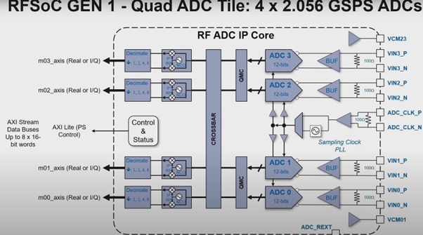

								
# 									MMWSDR Notes
# Lesson 0:

### Working with the RFSoC 2x2 remotely
The RFSoC 2x2 board is connected to a Workstation in the Wireless Lab at NYU Wireless. This machine can be accessed remotely with the cross-platform screen sharing system, VNC. In order to remotely login and use the board, the following steps can be followed,
**Important Note**:
To login to the remote system one must either be connected to the NYU Network directly or use the NYU VPN.
	Download a VNC application(in this case RealVNC has been used) by going to this link and choosing the download files based on your operating system.
	Using the downloaded file install the application on your Desktop or Mac
#### For Windows:
	Go to the Start Menu and open RealVNC Viewer.
	Once the window opens up, go to File -> New Connection, another window pops-up
	In this new window enter the host name or IP address along with a Name of your choice.
**Note**: The name doesn’t affect the connection to the system, it is simply a nickname that you give.
	Once done an icon with the nickname provided appears on the original RealVNC window. Double click on this, click continue and enter the password to connect to the system.
## Lesson 0.1: Introduction to RFSoC 2x2 board
The RFSoC 2x2 board is an SDR board that can be used to emulate a radio system. The 2x2 has high speed RF ADCs (2 no.s) to sample RF signals directly without the need of any mixer circuitry, which is then sent to the ZYNQ Ultrascale+ chip on the board; it also has 2 RF DACs to transmit data out from the board. The ZYNQ Ultrascale+ chip contains 2 processing components, that is, a set of ARM core processors (Processing System) and an FPGA (Programmable Logic) along with some memory elements such as DRAMs. The ARM core processors act as the host and the FPGA acts as the target. Using a framework called PYNQ we can communicate with the processing system through a browser where the browser acts as the terminal to send commands as well as a UI front end to display received data.

The RFSoC's architecture is as below.

This [link](http://www.rfsoc-pynq.io/rfsoc_2x2_overview.html) has detailed information on the RFSoC's architecture.

**Important:** The RFSoC 2x2 board has been discontinued and most links leading from the above link would be redirected to the corresponding pages for the RFSoC 4x2. To go to the 2x2 board's corresponding page please replace the "….4x2…." in the URL to "….2x2…."

Example: When a link for the 2x2 is selected a 4x2 page is loaded with the following URL

To go to the 2x2 page, the URL can be changed to

## Lesson 0.2: Setting up connection to RFSoC to open Jupyter notebook on browser
As mentioned in Lesson 0.9 the RFSoC contains 2 key processing elements, i.e a Processing System (PS)(which has an operating system) and Programmable Logic (which has an FPGA Image and some bitstream file in it). This system is connected to the workstation that runs Linux. We use said workstation system to connect to and control the board.
Usually the flow of data is as follows:
Processing System ↔ Progammable Logic ↔ RF Front End
Where, data originates from the Processing System for the Transmitter Configuration and as for the Receiver Configuration it’s the reverse where data origination is from the RF Front End.
The following section explains the method to connect to the PS and program on the same.
### Connecting to the board

Once the boot sequence is finished, the board can be accessed with a browser. On the URL bar type

https:192.168.3.1:9090/lab

This is the default IP Address of a 2x2 board. The /lab part gives us access to the entire Jupyter lab instead of just the notebook, thus providing extra features such as a terminal.

Once the URL is entered Jupyter lab opens with certain getting started files and example files. These files contain PYNQ examples such as Spectrum Analyser where the user can transmit a tone at a certain frequency from the 2x2 board and receive a certain band on the same board 2x2. The received and sampled signals are processed to give a spectrum around the centre frequency set for the receiver, and if the transmitted signal is within this band a tone can be seen.

While the above mentioned steps allows one to use a browser and PYNQ as a terminal or semi GUI for the PS to transmit and receive, there is no method mentioned in the PYNQ documentation to upload information from say a file on the workstation (say a bin file containing the samples to be transmitted) to the PS; but this isn’t an issue in itself because PYNQ is interfaced with using Python.

There are many ways to establish a connection but the one we use is through a TCP link. Essentially a  server code is run on the workstation and its corresponding client code is run on the Jupyter notebook in the browser. More on this has been discussed in Lesson 2.
