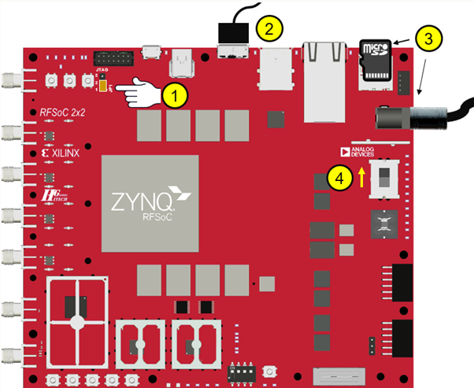
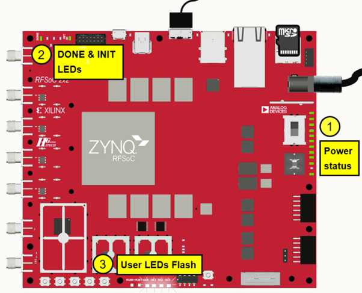

# Lesson 1: Plugging and setting up the FPGA Board
## Loading Image onto RFSoC 2x2 board

Steps to follow to load a PYNQ image

**Step 1:** Download the image from the above link.

Note: This [link](http://www.pynq.io/board.html) contains the latest standard PYNQ RFSoC 2x2 image which can be downloaded.

**Step 2:** Flash image onto microSD card.

**Note:** The RFSoC comes with an SD card that has a preloaded image, but if one needs to boot up a different or the latest image, they can do so by flashing said image on a microSD card. The recommended size of the microSD card is 16GB as the standard RFSoC image is 8+GB.

**Note:** Balena-Etcher is recommended for flashing the image onto the microSD as certain other flashing software do not perform the necessary CRC check on the image post flash, which could cause a corrupted file to be left in the SD card. Alternatively, use command line: 

```
sudo dd bs=4M if=/path/to/image/ of=/path/to/usb
sync
sudo eject /path/to/usb
```

**Note:** For information on how to build SD card images, visit this [link](https://pynq.readthedocs.io/en/latest/pynq_sd_card.html).

**Step 3:** Insert the microSD card on the board. Ensure that the pins 1 & 2 on jumper JP1/JTAG _(1)_ are Connected to configure the board to boot from SD Card.



**Step 4:** Connect the microUSB 3.0cable to port _(2)_ as shown above and the other end (USB) to a computer. If a microUSB 3.0 cable isn't available, a microUSB 2.0 cable works too (the port is backwards compatible). And also connect the power cable to the board.

**Note:** The device is connected to the computer through an Ethernet via USB link and so it appears on the system as an IP address.

**Step 5:** Flip the switch marked _(4)_ on the above image.



At first, 11 out of the 12 Power status LEDs start glowing as shown above _(1)_. After about 40 seconds the Init and Done LEDs _(2)_ start glowing green. And a few seconds later the User LEDs start flashing for a few seconds. After that, when User LEDs glow solid, it implies that the boot sequence is complete and successful.

**Important:** If the Init and Done LEDs both glow in red immediately after the power is turned on in boot mode, it implies that the image is either the wrong one or is corrupted and needs to be changed.
