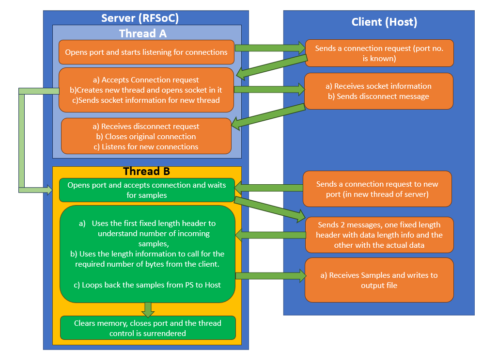

# Lesson 2:

#### Disclaimer

The python program for this lesson is present in the "Client-Server Python Files" folder. The program in this folder does not represent the entire system. It is merely a portion of the system that encompasses the topics discussed in this lesson.

#### Required Python Libraries :
The following libraries are a prerequisite to run the code in the "Client-Server Python Files".

1) numpy
2) socket
3) pickle
4) threading

### Establishing a socket link between Host and RFSoC PS:

To ensure scalability and maintainability the following architecture was followed while designing the socket link.

The flow goes as follows; 
1) The RFSoC acts as the Server and looks for connections. The Host,that is the client, from where samples need to be sent connects to the RFSoC through a known IP address and port number.
2) Once connection is established the RFSoC immediately checks for availability of resources and creates a new thread, where a new TCP socket is opened, the port information for the same is sent back to the host.
3) The Host receives the new port information, sends a request for the original socket connection to be closed, and requests for a connection with the new thread that was created.
#### NOTE: Since the original socket connection is closed almost immediately, other users can access it to have themselves alloted a resource (if any available) while the first host is still communicating with the PS on a different thread.
4) The Host then starts sending the samples to the PS (new thread) in frames.
#### NOTE: The PS handles all communication and synchronization with the PL, and the PL itself does the major processing on the samples.
6) The PS then writes the frame of samples into the PS DRAM and sends it to the PL through the AXI-DMA streaming.
7) The PL then processes the samples (More on this in Lesson 3) and sends the data back to the PS DRAM through the AXI-DMA.
8) The Host, which after sending the samples is waiting , now gets back the processed samples and writes it to an output file. Post this is sends the next frame of data and the whole process repeats from step 3.
9) Once the end of the file is reached, the host sends an "eof" message through the socket link to the PS, indicating that the socket connection can be severed and that the thread can be released.

The below block diagram explains the same system in a figure format

#### Please note:

The current code acts as a proof of concept but is subject to change based on the requirements of the projects and any bugs that may arise in the future.