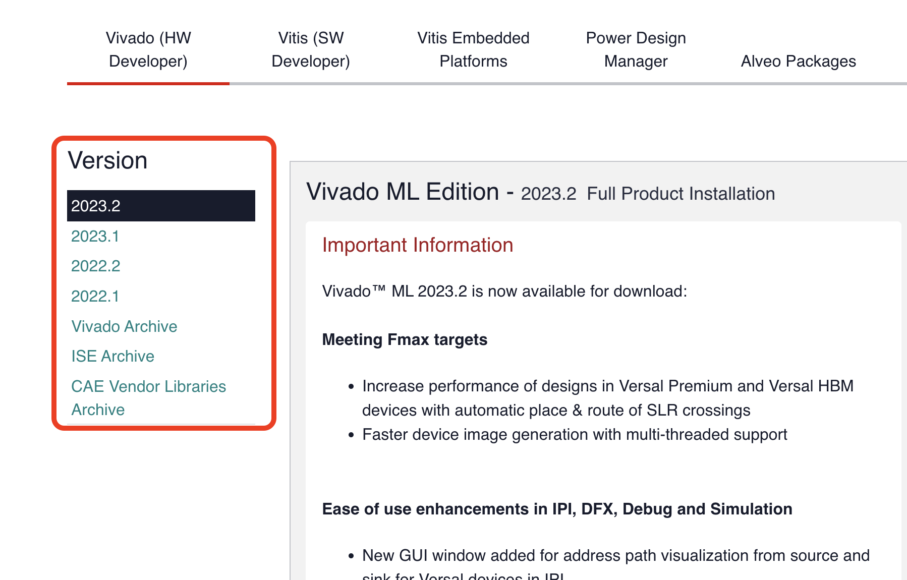
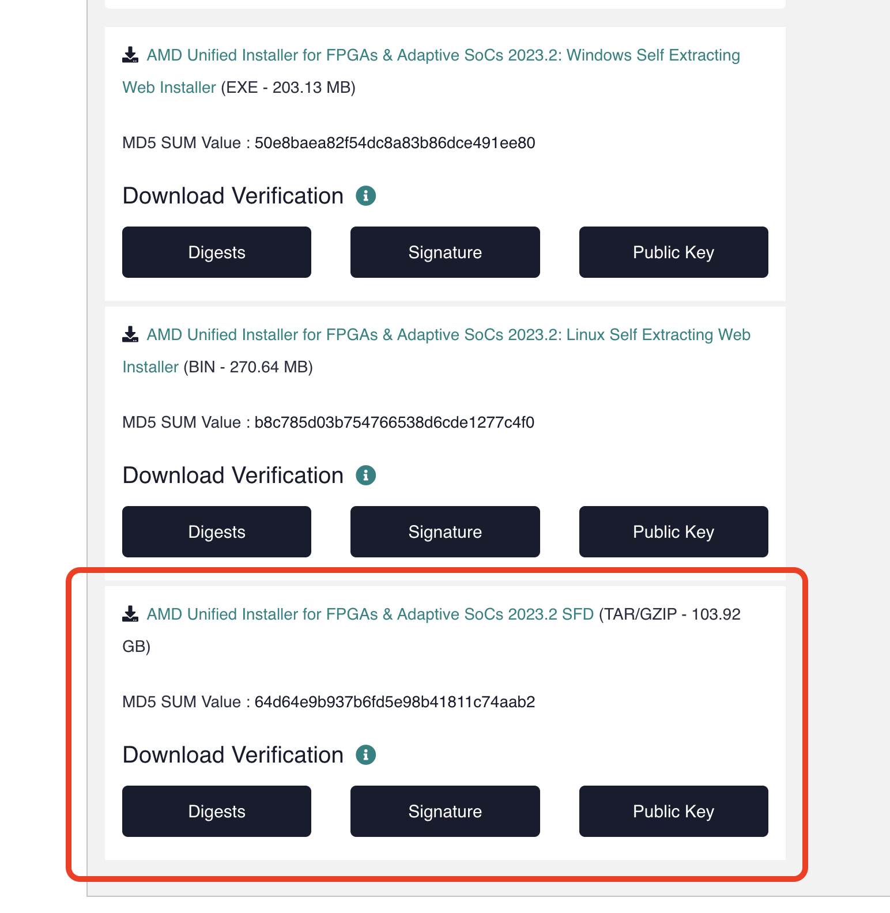
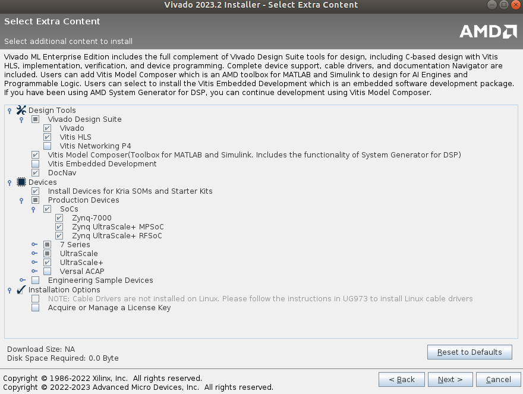

# Vivado Installation and Licensing

Vivado is one of the most widely used academic tools for hardware and hardware-related development projects. Contributing factors are its standard IP component library and support for a wide variety of boards which are both customizable and constantly updated by the Xilinx Community. The licensing is generally free and should support most of the boards with some case-by-case limitations.

In this tutorial, we aim to set up the Vivado environment for RFSoC projects and the corresponding licenses. Here we set out to install the latest version of the Vivado for Linux systems. Additional links for the Windows systems and their configurations are added below. 

## DOWNLOAD

**Login to your Xilinx account or create one using the NYU email. A free account is needed to download the software**

* Open the [Xilinx Vivado Download](https://www.xilinx.com/support/download.html) page. Select the version of choice, depending on any specific needs, we went with the latest one.

<p align="center">

</p>

Now you could either choose to download the installer and then let it handle all the file downloads and installation or download the tar.zip file unpack it and then install it. We had some issues with the former approach so we chose the latter one. 
* Select the required package and it will lead you to a form, fill in your details here and click on download. It will download the Xilinx_Unified_2020.2_1118_1232.tar.gz file.

<p align="center">

</p>

* Navigate to the downloads folder on the Linux system and extract the files from the Xilinx_Unified_2020.2_1118_1232.tar.gz archive: 
```
tar -xvf Xilinx_Unified_2020.2_1118_1232.tar.gz
```

Run the installer: 
```
sudo ./xsetup
```
## INSTALLER OPTIONS
* Enter your Xilinx account information, and select Download and Install Now.
* On the Select Product to Install screen, choose Vivado ML Enterprise edition as the standard edition doesn't support the RFSoCs.
* On the customization screen, uncheck anything if required, except make sure you have the RFSoC files installed as shown in the pic.

<p align="center">

</p>

* Install Cable Drivers
```
cd /tools/Xilinx/Vivado/2020.2/data/xicom/cable_drivers/lin64/install_script/install_drivers
sudo ./install_drivers
```

* On the next screen, agree to all boxes.
* On the next screen, choose an installation location with enough space.
* On the next screen, click Install and wait a while.

## Opening the Vivado 
Once the software is installed it can be accessed with normal user privileges as follows:
```
source /tools/Xilinx/Vivado/2023.2/settings64.sh
vivado
```

**Note:** But for making any installation changes to the software or any license changes open/access the vivado with root privileges as follows:
```
sudo -s
source /tools/Xilinx/Vivado/2023.2/settings64.sh
vivado
```
  
## Licencing - Generation and Updating

The license file for the Vivado should be automatically added. If the license expires and you want to add some other licenses, it can be either using the Vivado License Manager interface or the Linux terminal.

**Generating a Node-Locked Licence**

For adding a new license or updating an existing one, you need to first generate a new one from your Xilinx account. Open this [Licencing page](https://www.xilinx.com/member/forms/license-form.html) and login to your account if prompted fill out the details as before and click on Next.


----image needs to be added here ----

* Here check the Vivado ML edition license and click on the **Generate Node-Locked Licence**
* Select/enter the MAC address of the system where you have installed the software and click on Next.
* Confirm the details of the license and then click on next.

The license file will be emailed to your NYU email address - or another email used to create the account

**Vivado Licence Manager**

For making any changes to software make sure to open Vivado with root privileges as stated above. 

* Navigate to the **Help** section in the toolbar on the top and then click on **Manage Licence**.
* Now download the Xlinix license file from the email onto your local machine.
* .
* .

**Using the Terminal**


## Uninstalling Vivado
To uninstall the software, you will the root privileges.

```
sudo -s
cd /tools/Xilinx/.xinstall
./xsetup -Uninstall
```
**Note:** In some systems the Xilinx software might be installed in The 'opt' directory rather than 'tools' - depending on your installer selections. Make sure to check out and locate the appropriate directory.

## Vivado Store for adding addtional boards
---
## Useful Links
* For other installer options and system preferences or Windows OS check out this [site](https://byu-cpe.github.io/ComputingBootCamp/tutorials/install_vivado/)
