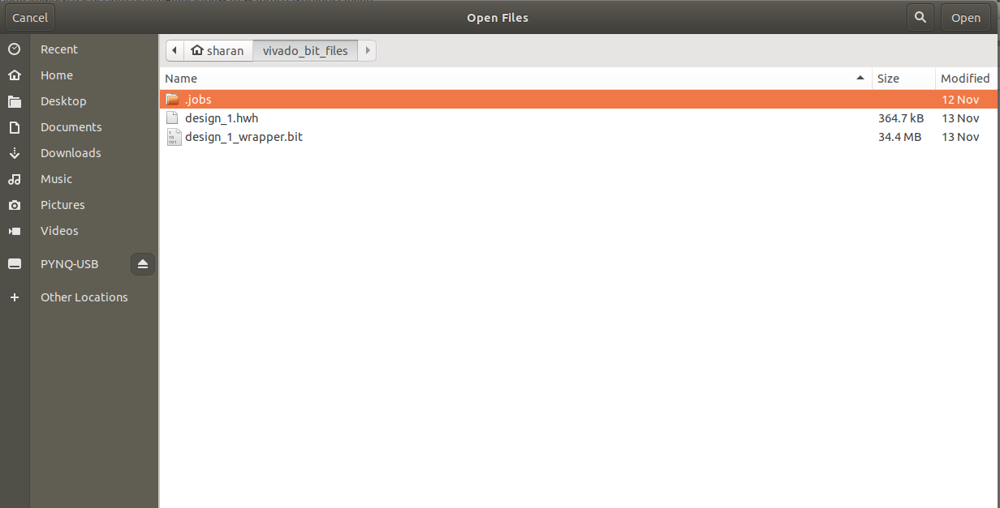
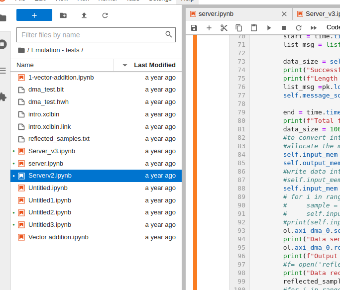

# Basic Vivado and Pynq tutorials

So in the following steps what we do is build and entire circuit in Vivado using the pre-built xilinx blocks/ips. We can aslo add our own custom ips but thats for later. In Vivado specifically we create the entire system with PS and PL blocks and their interfaces and finally generate the .bit aand .hwh files for the design, whic are then used in Pynq code to control these hardware entitiesfrom software.

## 1.Introduction to Vivado 
This is good [tutorial](https://discuss.pynq.io/t/tutorial-creating-a-hardware-design-for-pynq/145) from the Pynq community that gives the basic idea of all the necessary steps in Vivado.

## 2.Useful sample project - Using the DMA
This 3 part tutorial [Part-1](https://discuss.pynq.io/t/tutorial-pynq-dma-part-1-hardware-design/3133)  [Part-2](https://discuss.pynq.io/t/tutorial-pynq-dma-part-2-using-the-dma-from-pynq/3134) is an extension of the previous tutorial but is mostly similar in the process. The design followed here allows us towrite some data through pynq into the PS-DRAM and then send the data to the PL using the DMA interface, and then the PL has a FIFO which takes in the input and sends back the smae - kind of reflects the sent data with some delay. The received data is then again stored in the PS-DRAM in another allocated allocation. While we control what data to be sent and when to send it from the Pynq/python code the path it follows is defined in the Vivado circuit.

The tutorial completely explains what a DMA is and how it works, there are just some changes in the end.

**Note**:In case of different Vivado versions the location of the .bit amf .hwh files may spmetimes differ and may also have different names. Make sure to rename them properly as shown in the images below. In the below images we have renamed the .bit and .hwh files to dma_test.xxx,

Then upload them into the RFSoC Sd-card theough the Pynq notebook and rename them if necessary.

After that we can start to import the ghardwrae design as an Overlay and start writing python commands to define the behaviour of the entire system.
