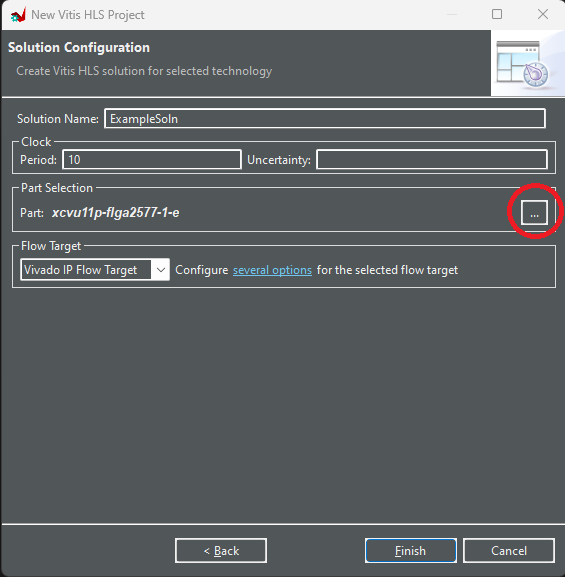
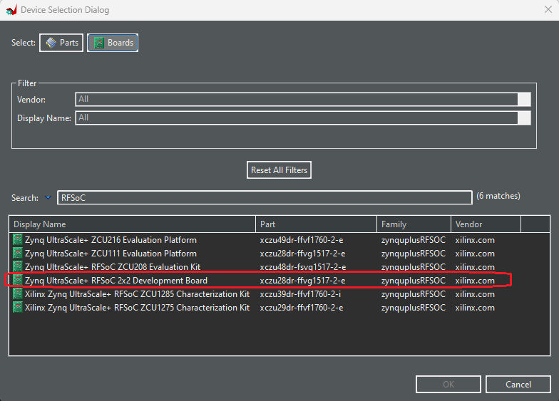
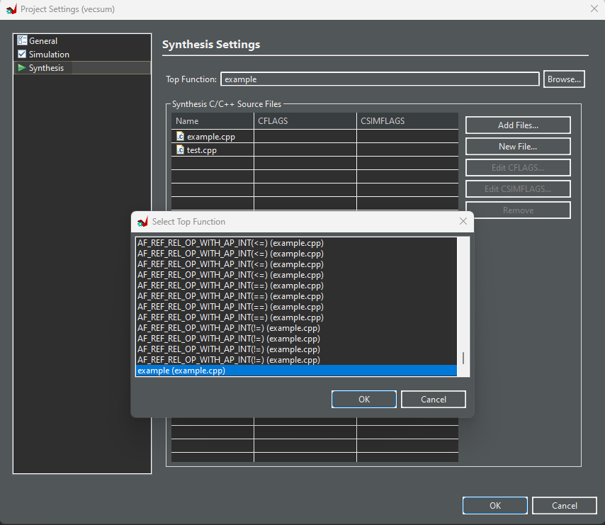
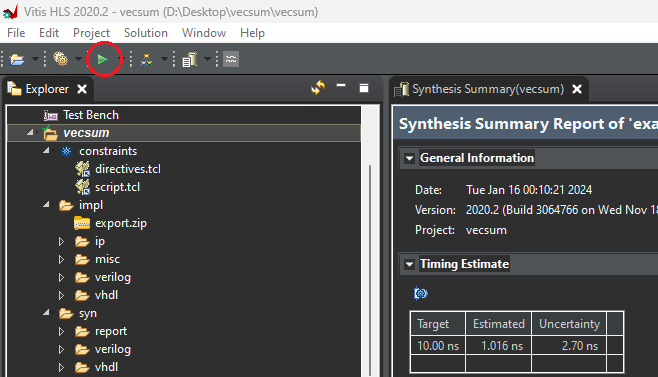

# Lesson 5 : Writing logic in Vitis

 Vitis HLS is a software platform offered by Xlinix that enables FPGA programming using high level programming languages such as C++. In Vitis HLS one can take advantage of FPGA parallelism and hardware customization without the need for low-level hardware description. It simplifies the FPGA development process by allowing one to focus on algorithm development in familiar high-level languages, while the tool handles the generation of efficient hardware implementations. It automates the process of converting high-level code into hardware description language (HDL) code, eliminating the need for manual HDL coding. This accelerates the development cycle and reduces the barrier to entry for hardware design.

 Vitis HLS also includes optimization techniques to enhance the performance of generated hardware. One can apply pragmas and directives to guide the tool in optimizing for performance, area, or power consumption. It also enables developers to harness the parallel processing capabilities of FPGAs by automatically identifing opportunities for parallelism in the high-level code and generating hardware that takes advantage of parallel execution.

 Vitis HLS will be used in this project to write custom IPs, mainly the FIR filter for the Channel Emulator.

 ## Creating a project and source files:

 This section will deal with the general procedures that one has to follow to create a project.

 1) Once Vitis HLS is open, click on Create Project and type in the name of the project along with the location where the project file has to be saved. Click on **Next**.
 2) After this the design files are expected to be declared. These are the files in which the HLS code is written. If there is C++ code already present then it can simply be added to the project, else a new file can be created and saved using the window. Click on **Next**
 3) The upcoming section is one where the testbench files can be added or created. A testbench file is a simulation file used to validate the source code, greatly helping in debugging. Click on **Next**
 4) Post this is the final section of the pop-up where the solution name, clock period and part selection are to be entered. Depending on the requirement the clock can be set to a specific value. This can be changed later as well. The other important parameter to set is the part(or in other words the board that the IP will be run on). The HLS code is synthesized based on the part that is selected here. To select the part click on "**... -->Select Boards-->Select RFSoC 2x2**". Click on **Next**.

 5) Once the above steps are completed the finish button can be clicked and the project is now ready.

## Synthesis and RTL Export
Once the project is ready one can start editing the source files. It is important to note that there can be multiple source files under a project but the main file that will be run on the FPGA when the specific IP is called is the top level function. This can be specified by going to "**Project(in the Menu bar) --> Project Settings --> Synthesis --> Browse --> Browse to the bottom and select the name of the source file that needs to be the top function**".

After the code is written the C synthesis can be performed (conversion of HLS code to low level hardware description language) by clicking on the Play button on the tools bar. 

Once the synthesis has finished successfully one can export the RTL onto a file;  This file is later used in the Vivado design to use the IP programmed using C++. One can export the RTL file by going to "**Solution --> Export RTL**". Fill in the details of where the file needs to be saved and what its displahy name is (This is the name that the IP has on Vivado later). This file is later used in the Vivado design to use the IP programmed using C++.

#### Note: When the RTL file is being exported, certain versions of Vitis HLS throw up errors which seems to be related to neither the code that is written nor the configurations made on the environment. This is a bug in Vitis HLS that can be circumvented by backdating the system clock (the year 2021 has been found to word). This issue is especially seen in Vitis HLS 2020.

## Importing RTL file on Vivado :

Once the RTL file is created, for the same to appear as a block on the .bd file on Vitis is has to be imported as an IP repsitory on Vivado.

This can be done in the following way:
 1) Once the project is opened on Vivado select the **Settings** option on the Flow Navigator (the bar on the left side of the window)
 2) Under **Project Settings** go to **IP --> Repository**
 3) Click on the **+** icon and navigate to and select the directory where the RTL file is saved.
 4) Once this is done click on **Apply** and then on **OK**.
 5) Now one can find the IP as part of the Add IP list.
